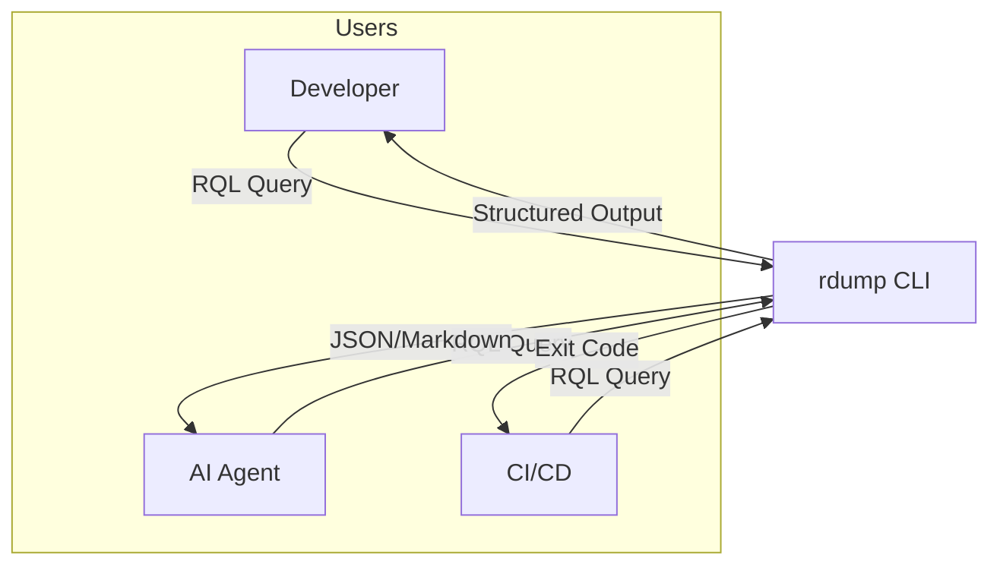
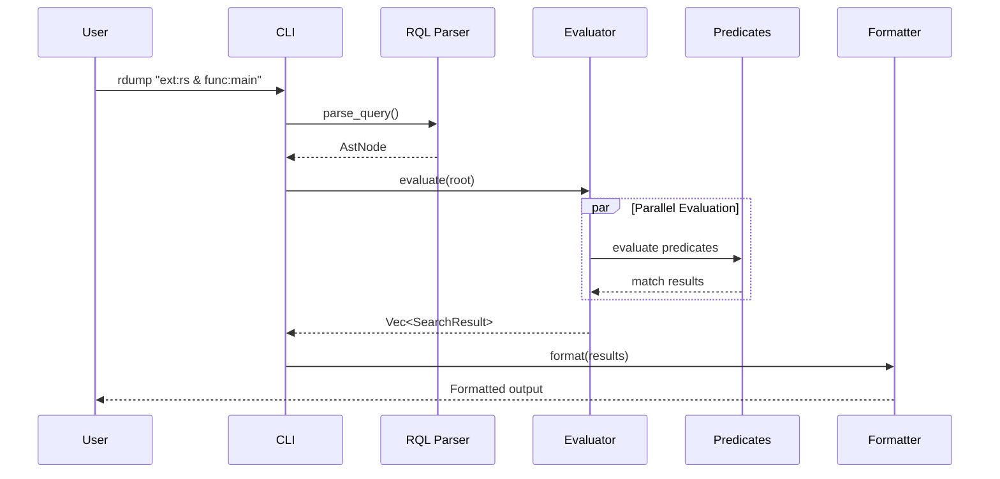
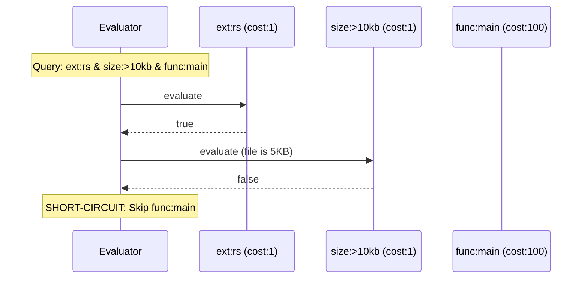
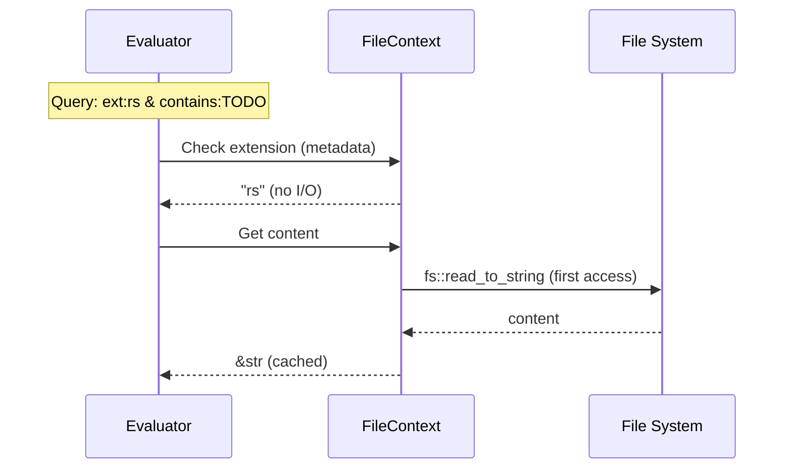

# rdump Architecture Document

**Version:** 3.1
**Status:** Complete
**Last Updated:** 2025-11-20

---

## Table of Contents

1. [Introduction](#introduction)
2. [High-Level Architecture](#high-level-architecture)
3. [Tech Stack](#tech-stack)
4. [Core Types](#core-types)
5. [Components](#components)
6. [Core Workflows](#core-workflows)
7. [Predicate Reference](#predicate-reference)
8. [Source Tree](#source-tree)
9. [Configuration](#configuration)
10. [Error Handling](#error-handling)
11. [Coding Standards](#coding-standards)
12. [Test Strategy](#test-strategy)

---

## Introduction

### Vision

rdump is a code-aware file search tool that combines filesystem filtering, content search, and structural code analysis through tree-sitter parsing.

### Problem

Manual context gathering for AI-assisted development is slow and produces noisy, unstructured results.

### Solution

Pipeline architecture: **Parse → Evaluate → Format** with layered predicate costs (metadata → content → semantic).

### Goals

- Fast, expressive file search with zero configuration
- Complex queries through RQL (rdump Query Language)
- Semantic code queries using tree-sitter
- Parallel execution with rayon
- Deterministic, reproducible output

### Non-Goals

- IDE integration
- File watching
- Cross-repository search
- Source code modification
- LSP implementation

---

## High-Level Architecture

### Architectural Style

**Modular Monolith CLI Application with Pipeline Architecture**

```
┌─────────────────────────────────────────────────────────────┐
│                     USER INTERFACE                          │
│  Query String  │  Options/Flags  │  Output Format           │
└───────────────────────┬─────────────────────────────────────┘
                        ▼
┌─────────────────────────────────────────────────────────────┐
│                   QUERY PROCESSING                          │
│  Lexer (pest) → Parser (pest) → AST Builder                 │
└───────────────────────┬─────────────────────────────────────┘
                        ▼
┌─────────────────────────────────────────────────────────────┐
│                  EVALUATION ENGINE                          │
│  Parallel File Walker (rayon + ignore)                      │
│  ┌──────────────┬─────────────┬────────────────┐            │
│  │  Metadata    │   Content   │    Semantic    │            │
│  │  (cost: 1)   │  (cost: 10) │   (cost: 100)  │            │
│  └──────────────┴─────────────┴────────────────┘            │
│         Short-Circuit Evaluation                            │
└───────────────────────┬─────────────────────────────────────┘
                        ▼
┌─────────────────────────────────────────────────────────────┐
│                   OUTPUT FORMATTING                         │
│  Markdown │ JSON │ Cat │ Paths │ Hunks │ Find              │
└─────────────────────────────────────────────────────────────┘
```

### System Context



### Key Patterns

1. **Pipeline Pattern** - Discrete stages with single responsibility
2. **Trait-Based Predicates** - `PredicateEvaluator` trait for extensibility
3. **Registry Pattern** - HashMap for O(1) predicate lookup
4. **Lazy Evaluation** - `OnceCell` for content/AST caching
5. **Short-Circuit Evaluation** - Boolean operators stop early
6. **Cost-Ordered Evaluation** - Cheapest predicates first
7. **Data-Driven Profiles** - Language support via profile structs
8. **Parallel Iterators** - rayon for multi-core processing

---

## Tech Stack

### Core Dependencies

| Category | Technology | Version | Purpose |
|----------|------------|---------|---------|
| Language | Rust | Edition 2021 | Primary language |
| CLI | clap | 4.5.49 | Argument parsing |
| Parser | pest | 2.8.3 | RQL grammar |
| Parallelism | rayon | 1.11.0 | Multi-core execution |
| File Discovery | ignore | 0.4.25 | Directory traversal |
| Code Parsing | tree-sitter | 0.25.10 | AST generation |
| Highlighting | syntect | 5.3.0 | Syntax highlighting |
| Regex | regex | 1.12.2 | Pattern matching |
| Serialization | serde | 1.0.228 | Data serialization |
| JSON | serde_json | 1.0.145 | JSON output |
| Configuration | toml | 0.9.8 | Config parsing |
| Errors | anyhow | 1.0.100 | Error handling |
| Lazy Init | once_cell | 1.20.0 | Thread-safe lazy statics |

### Tree-sitter Grammars

| Language | Version | Extensions |
|----------|---------|------------|
| Bash | 0.25.0 | .sh, .bash |
| C | 0.24.1 | .c |
| C# | 0.23.1 | .cs, .csx |
| C++ | 0.23.4 | .cpp, .cc, .cxx, .hpp, .hh, .hxx |
| CSS | 0.25.0 | .css |
| Elixir | 0.3.4 | .ex, .exs |
| Go | 0.25.0 | .go |
| Haskell | 0.23.1 | .hs, .lhs |
| HTML | 0.23.2 | .html |
| Java | 0.23.5 | .java |
| JavaScript | 0.25.0 | .js |
| Lua | 0.2.0 | .lua |
| OCaml | 0.24.2 | .ml, .mli |
| PHP | 0.24.2 | .php |
| Python | 0.25.0 | .py |
| React (JSX/TSX) | 0.25.0 | .jsx, .tsx |
| Ruby | 0.23.1 | .rb |
| Rust | 0.24.0 | .rs |
| Scala | 0.24.0 | .scala |
| SQL | 0.3.11 | .sql (generic, postgres, mysql, sqlite) |
| Swift | 0.7.1 | .swift |
| TypeScript | 0.23.2 | .ts |
| Zig | 1.1.2 | .zig |

---

## Core Types

### FileContext

Central data structure for file evaluation with lazy-loaded content and AST.

```rust
pub struct FileContext {
    pub path: PathBuf,
    pub metadata: Metadata,
    content: OnceCell<String>,
    tree: OnceCell<Tree>,
    matches: RefCell<Vec<MatchLocation>>,
}

impl FileContext {
    pub fn new(path: PathBuf) -> Result<Self>;
    pub fn content(&self) -> Result<&str>;
    pub fn tree(&self, profile: &LanguageProfile) -> Result<&Tree>;
    pub fn size(&self) -> u64;
    pub fn modified(&self) -> SystemTime;
    pub fn extension(&self) -> Option<&str>;
    pub fn file_name(&self) -> &str;
    pub fn add_match(&self, line: usize, col: usize, len: usize);
}
```

### AstNode

Parsed RQL query as abstract syntax tree.

```rust
pub enum AstNode {
    And(Box<AstNode>, Box<AstNode>),
    Or(Box<AstNode>, Box<AstNode>),
    Not(Box<AstNode>),
    Predicate { key: String, value: String },
}

impl AstNode {
    pub fn min_cost(&self) -> u32;
    pub fn predicate_count(&self) -> usize;
}
```

### LanguageProfile

Data-driven definition for language-specific semantic predicates.

```rust
pub struct LanguageProfile {
    pub name: &'static str,
    pub extensions: &'static [&'static str],
    pub parser: fn() -> Parser,
    pub predicates: &'static [(&'static str, &'static str)],
}

impl LanguageProfile {
    pub fn get_query(&self, predicate: &str) -> Option<&str>;
    pub fn supports(&self, predicate: &str) -> bool;
    pub fn predicate_names(&self) -> Vec<&str>;
}
```

### SearchResult

Matching file with metadata for output formatting.

```rust
#[derive(Debug, Clone, Serialize)]
pub struct SearchResult {
    pub path: PathBuf,
    pub size: u64,
    pub modified: DateTime<Utc>,
    pub content: Option<String>,
    pub matches: Vec<MatchLocation>,
    pub language: Option<String>,
}

#[derive(Debug, Clone, Serialize)]
pub struct MatchLocation {
    pub line: usize,
    pub col: usize,
    pub len: usize,
}
```

### PredicateEvaluator

Interface for all predicate implementations.

```rust
pub trait PredicateEvaluator: Send + Sync {
    fn evaluate(&self, value: &str, ctx: &mut FileContext) -> Result<bool>;
    fn cost(&self) -> u32;
    fn description(&self) -> &str;
    fn examples(&self) -> &[&str] { &[] }
    fn aliases(&self) -> &[&str] { &[] }
}
```

**Cost Tiers:**
| Tier | Cost | Examples |
|------|------|----------|
| Metadata | 1 | `ext`, `name`, `path`, `size`, `modified` |
| Content | 10-20 | `contains`, `matches` |
| Semantic | 100 | `func`, `struct`, `import`, `call` |

### Configuration

```rust
#[derive(Debug, Clone, Serialize, Deserialize)]
pub struct Config {
    pub format: Format,
    pub color: ColorMode,
    pub presets: HashMap<String, String>,
    pub ignore_patterns: Vec<String>,
    pub context_lines: usize,
}

#[derive(Debug, Clone, Copy, Serialize, Deserialize)]
pub enum Format {
    Markdown, Json, Cat, Paths, Hunks, Find,
}

#[derive(Debug, Clone, Copy, Serialize, Deserialize, Default)]
pub enum ColorMode {
    Always, Never, #[default] Auto,
}
```

---

## Components

### CLI Parser

**Location:** `src/main.rs`, `src/commands/`

```rust
#[derive(Parser)]
pub struct Cli {
    pub command: Option<Command>,
    pub query: Option<String>,
    pub format: Format,
    pub output: Option<PathBuf>,
    pub line_numbers: bool,
    pub context: Option<usize>,
    pub before: Option<usize>,
    pub after: Option<usize>,
    pub color: ColorMode,
    pub preset: Option<String>,
    pub verbose: bool,
    pub no_ignore: bool,
    pub hidden: bool,
    pub threads: Option<usize>,
    pub path: PathBuf,
}

#[derive(Subcommand)]
pub enum Command {
    Lang { subcommand: LangCommand },
    Preset { subcommand: PresetCommand },
}
```

### RQL Parser

**Location:** `src/parser.rs`, `src/rql.pest`

```rust
#[derive(Parser)]
#[grammar = "rql.pest"]
pub struct RqlParser;

pub fn parse_query(query: &str) -> Result<AstNode>;
fn build_ast(pair: Pair<Rule>) -> Result<AstNode>;
fn extract_value(pair: Pair<Rule>) -> String;
```

**Grammar (rql.pest):**
```pest
query = { SOI ~ expr ~ EOI }
expr = { term ~ (or_op ~ term)* }
term = { factor ~ (and_op ~ factor)* }
factor = { not_op? ~ (group | predicate) }
group = { "(" ~ expr ~ ")" }
predicate = { key ~ ":" ~ value }
```

### Evaluator Engine

**Location:** `src/evaluator.rs`

```rust
pub struct Evaluator {
    ast: AstNode,
    options: EvalOptions,
}

pub struct EvalOptions {
    pub no_ignore: bool,
    pub hidden: bool,
    pub threads: usize,
    pub verbose: bool,
}

impl Evaluator {
    pub fn new(ast: AstNode, options: EvalOptions) -> Self;
    pub fn evaluate(&self, root: &Path) -> Result<Vec<SearchResult>>;
    fn evaluate_file(&self, path: &Path) -> Result<Option<SearchResult>>;
    fn evaluate_node(&self, node: &AstNode, ctx: &mut FileContext) -> Result<bool>;
}
```

### Predicates

**Location:** `src/predicates/`

#### Metadata Predicates

```rust
pub struct ExtPredicate;      // cost: 1
pub struct NamePredicate;     // cost: 1
pub struct PathPredicate;     // cost: 1
pub struct SizePredicate;     // cost: 1
pub struct ModifiedPredicate; // cost: 1
```

#### Content Predicates

```rust
pub struct ContainsPredicate; // cost: 10
pub struct MatchesPredicate;  // cost: 20
```

#### Semantic Predicates

```rust
pub struct SemanticPredicate {
    name: &'static str,
}

impl SemanticPredicate {
    pub fn new(name: &'static str) -> Self;
}
// cost: 100
```

### Formatter

**Location:** `src/formatter.rs`

```rust
pub struct Formatter {
    format: Format,
    options: FormatOptions,
    highlighter: Option<SyntaxHighlighter>,
}

pub struct FormatOptions {
    pub line_numbers: bool,
    pub context_before: usize,
    pub context_after: usize,
    pub color: ColorMode,
}

impl Formatter {
    pub fn new(format: Format, options: FormatOptions) -> Self;
    pub fn format(&self, results: &[SearchResult]) -> Result<String>;
    fn format_markdown(&self, results: &[SearchResult]) -> Result<String>;
    fn format_json(&self, results: &[SearchResult]) -> Result<String>;
    fn format_cat(&self, results: &[SearchResult]) -> Result<String>;
    fn format_paths(&self, results: &[SearchResult]) -> Result<String>;
    fn format_hunks(&self, results: &[SearchResult]) -> Result<String>;
    fn format_find(&self, results: &[SearchResult]) -> Result<String>;
}
```

---

## Core Workflows

### Complete Query Execution



### Short-Circuit Evaluation



### Lazy Loading



---

## Predicate Reference

### Metadata Predicates (Cost: 1)

| Predicate | Syntax | Description |
|-----------|--------|-------------|
| `ext` | `ext:rs` | Match file extension |
| `name` | `name:*.rs` | Match filename with glob |
| `path` | `path:src/api` | Path contains substring |
| `in` | `in:src` | Files in directory |
| `size` | `size:>100kb` | Filter by size |
| `modified` | `modified:<1d` | Filter by time |

### Content Predicates (Cost: 10-20)

| Predicate | Syntax | Description |
|-----------|--------|-------------|
| `contains` / `c` | `contains:TODO` | Literal substring |
| `matches` / `m` | `matches:/fn\s+\w+/` | Regex search |

### Semantic Predicates (Cost: 100)

| Predicate | Languages | Description |
|-----------|-----------|-------------|
| `func` | All | Function definition |
| `class` | Python, JS, TS, Java | Class definition |
| `struct` | Rust, Go | Struct definition |
| `enum` | Rust, TS, Java | Enum definition |
| `trait` | Rust | Trait definition |
| `interface` | TS, Go, Java | Interface definition |
| `import` | All | Import statement |
| `call` | All | Function call |
| `component` | React | React component |
| `hook` | React | Hook call |

### Operators

**Boolean:** `&` (and), `|` (or), `!` (not), `()` (grouping)

**Size:** `>`, `<`, `=`, `>=`, `<=` with units `b`, `kb`, `mb`, `gb`

**Time:** `<` (within), `>` (older than) with units `s`, `m`, `h`, `d`, `w`

**Wildcard:** `.` matches any (e.g., `func:.` finds any function)

---

## Source Tree

```
rdump/
├── Cargo.toml
├── src/
│   ├── main.rs              # Entry point
│   ├── lib.rs               # Library exports
│   ├── parser.rs            # RQL parser
│   ├── rql.pest             # PEG grammar
│   ├── evaluator.rs         # Evaluation engine
│   ├── formatter.rs         # Output formatting
│   ├── config.rs            # Configuration
│   ├── commands/
│   │   ├── mod.rs
│   │   ├── search.rs
│   │   ├── lang.rs
│   │   └── preset.rs
│   └── predicates/
│       ├── mod.rs           # Registry and trait
│       ├── ext.rs
│       ├── name.rs
│       ├── path.rs
│       ├── size.rs
│       ├── modified.rs
│       ├── contains.rs
│       ├── matches.rs
│       └── code_aware/
│           ├── mod.rs       # Semantic engine
│           └── profiles/
│               ├── rust.rs
│               ├── python.rs
│               ├── javascript.rs
│               ├── typescript.rs
│               ├── go.rs
│               ├── java.rs
│               └── react.rs
└── tests/
    ├── common.rs
    ├── cli.rs
    └── *_test.rs
```

---

## Configuration

### Files

**Global:** `~/.config/rdump/config.toml`
**Local:** `.rdump.toml` (project root)

### Precedence

1. Command-line arguments (highest)
2. Local `.rdump.toml`
3. Global config
4. Built-in defaults (lowest)

### Example Config

```toml
format = "markdown"
color = "auto"
context_lines = 3

[presets]
rust-todos = "ext:rs & comment:TODO"
recent = "modified:<1d"
```

---

## Error Handling

| Category | Severity | Behavior |
|----------|----------|----------|
| Parse Error | Fatal | Exit with error |
| Config Error | Warning | Use defaults |
| File Error | Skip | Continue |
| Binary File | Skip | Silent |
| Encoding Error | Skip | Warning |

---

## Coding Standards

### Critical Rules

1. **Never clone `FileContext`** - Use references only
2. **Never use `unwrap()` on user data** - Always handle errors
3. **Predicates must be `Send + Sync`** - Required for parallel evaluation
4. **Predicates must be stateless** - All state in `FileContext`
5. **Always report predicate cost** - Required for optimization
6. **Results must be sorted** - Deterministic output
7. **Content must be valid UTF-8** - Skip binary files

### File Organization

- One predicate per file in `src/predicates/`
- One language profile per file in `src/predicates/code_aware/profiles/`
- Integration tests in `tests/` directory

---

## Test Strategy

### Test Types

| Type | Location | Focus |
|------|----------|-------|
| Unit | `src/*.rs` | Individual functions |
| Integration | `tests/*.rs` | End-to-end CLI |
| Language | `tests/*_search.rs` | Per-language semantics |

### Running Tests

```bash
cargo test                    # All tests
cargo test --test cli         # CLI tests only
cargo test rust_search        # Rust semantic tests
```

### Coverage Target

- Core modules: >80%
- Predicates: >90%
- Integration: All RQL features

---

## Change Log

| Version | Date | Changes |
|---------|------|---------|
| 3.1 | 2025-11-20 | Dependency stack refresh (core crates + tree-sitter grammar versions) |
| 3.0 | 2024-11-20 | Simplified to types and signatures |
| 2.0 | 2024-11-20 | Extensive expansion with implementations |
| 1.0 | 2024-11-20 | Initial architecture document |
